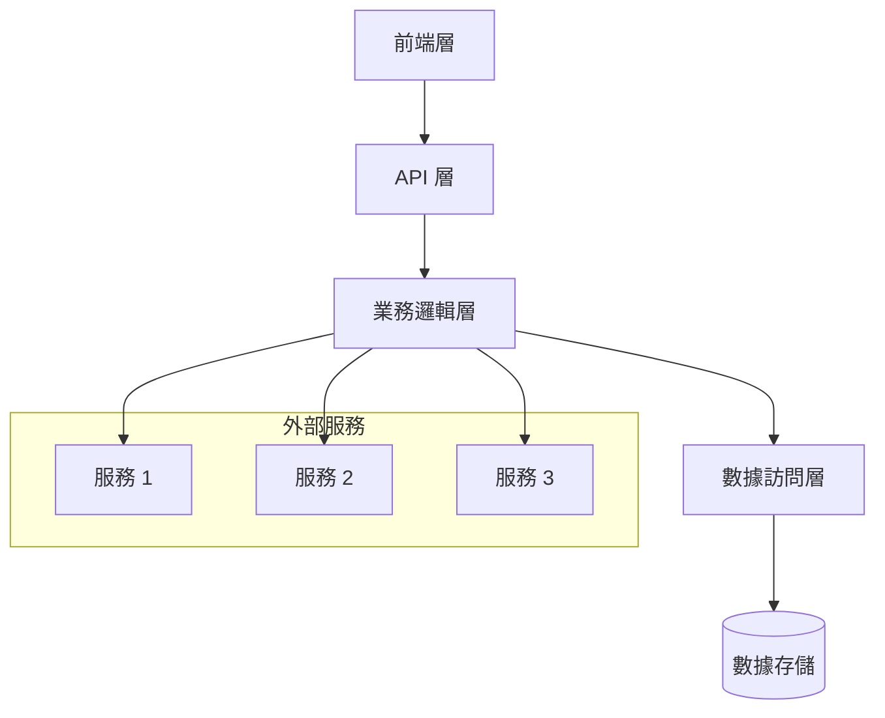
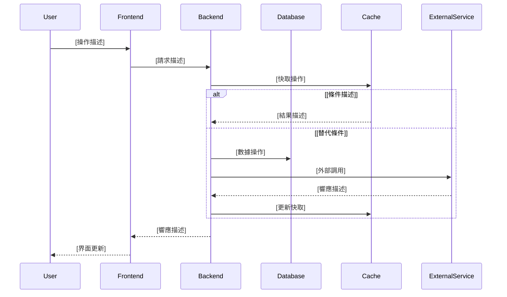

# [專案名稱] 系統架構設計文檔

## 文件資訊
| 項目 | 內容 |
|------|------|
| 文件狀態 | [草稿/審查中/已核准] |
| 版本 | [版本號] |
| 作者 | [作者姓名] |
| 審查者 | [審查者姓名] |
| 最後更新 | [YYYY-MM-DD] |

## 目錄
1. [系統概述](#系統概述)
2. [技術架構](#技術架構)
3. [數據架構](#數據架構)
4. [安全架構](#安全架構)
5. [部署架構](#部署架構)

## 系統概述
### 系統目標
[描述系統的主要目標和預期達成的效果]

### 核心功能
1. [核心功能 1]
2. [核心功能 2]
3. [核心功能 3]
4. [核心功能 4]

## 技術架構

### 前端技術棧
| 技術 | 版本 | 用途 | 說明 |
|------|------|------|------|
| [前端框架] | [版本號] | [用途說明] | [補充說明] |
| [狀態管理] | [版本號] | [用途說明] | [補充說明] |
| [開發語言] | [版本號] | [用途說明] | [補充說明] |
| [UI 框架] | [版本號] | [用途說明] | [補充說明] |
| [HTTP 客戶端] | [版本號] | [用途說明] | [補充說明] |

### 後端技術棧
| 技術 | 版本 | 用途 | 說明 |
|------|------|------|------|
| [後端框架] | [版本號] | [用途說明] | [補充說明] |
| [ORM/框架] | [版本號] | [用途說明] | [補充說明] |
| [數據庫] | [版本號] | [用途說明] | [補充說明] |
| [快取服務] | [版本號] | [用途說明] | [補充說明] |
| [消息隊列] | [版本號] | [用途說明] | [補充說明] |

### 系統組件圖


### 數據流程圖


## 安全架構

### 1. 認證機制
- [認證方式 1]
- [認證方式 2]
- [認證方式 3]

### 2. 授權控制
- [授權模型]
- [權限級別]
- [訪問控制]

### 3. 數據安全
- [加密方案]
- [數據脫敏]
- [備份策略]

### 4. 安全監控
- [監控指標]
- [告警機制]
- [應急響應]

## 部署架構

### 1. 開發環境
```bash
# 環境設置步驟
[步驟 1]
[步驟 2]
[步驟 3]
```

### 2. 測試環境
- [CI/CD 配置]
- [測試策略]
- [環境要求]

### 3. 預發布環境
- [配置要求]
- [測試類型]
- [驗證流程]

### 4. 生產環境
```yaml
# 部署配置模板
[配置示例]
```

### 5. 回滾機制
- [回滾策略]
- [版本控制]
- [監控方案]
- [應急處理]

## 性能優化

### 1. 前端優化
- [優化策略 1]
- [優化策略 2]
- [優化策略 3]

### 2. 後端優化
- [優化策略 1]
- [優化策略 2]
- [優化策略 3]

### 3. 數據庫優化
- [優化策略 1]
- [優化策略 2]
- [優化策略 3]

## 監控方案

### 1. 系統監控
- [監控指標]
- [告警閾值]
- [處理流程]

### 2. 業務監控
- [監控指標]
- [告警閾值]
- [處理流程]

### 3. 日誌管理
- [日誌級別]
- [收集方式]
- [存儲策略]

## 附錄

### A. 術語表
| 術語 | 定義 | 備註 |
|------|------|------|
| [術語 1] | [定義] | [備註] |
| [術語 2] | [定義] | [備註] |

### B. 參考文檔
- [參考文檔 1]
- [參考文檔 2]
- [參考文檔 3]

### C. 變更記錄
| 版本 | 日期 | 變更者 | 變更描述 |
|------|------|--------|----------|
| [版本] | [日期] | [變更者] | [描述] | 