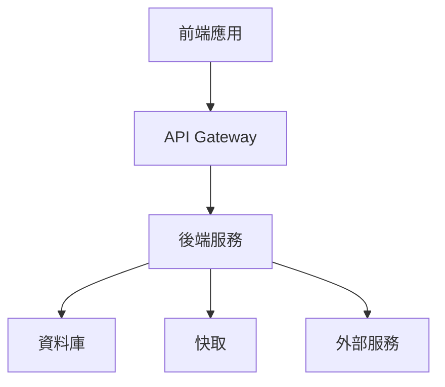

# [專案名稱] 技術規格書

## 系統架構

### 整體架構圖



### 元件說明
- [元件 1 說明]
- [元件 2 說明]
- [元件 3 說明]

## API 規格

### RESTful API

#### 端點 1
```yaml
路徑: /api/v1/[端點]
方法: [GET/POST/PUT/DELETE]
描述: [API 功能說明]

請求參數:
  - 名稱: [參數名]
    類型: [參數類型]
    必填: [是/否]
    說明: [參數說明]

回應格式:
  成功:
    狀態碼: 200
    內容:
      {
        "status": "success",
        "data": {
          [回應資料結構]
        }
      }
  
  錯誤:
    狀態碼: [4xx/5xx]
    內容:
      {
        "status": "error",
        "message": "[錯誤訊息]"
      }
```

## 資料庫結構

### 資料表設計

#### 表格 1
```sql
CREATE TABLE [表格名稱] (
    id BIGINT PRIMARY KEY,
    [欄位1] [類型] [限制],
    [欄位2] [類型] [限制],
    created_at TIMESTAMP,
    updated_at TIMESTAMP
);
```

### 索引設計
```sql
CREATE INDEX [索引名稱] ON [表格名稱] ([欄位]);
```

## 整合細節

### 外部服務整合

#### 服務 1
- 服務名稱：[名稱]
- 用途：[說明]
- 整合方式：[REST/GraphQL/gRPC]
- 認證方式：[認證方法]
- 重試策略：[策略說明]

## 安全考量

### 認證與授權
- [認證機制說明]
- [授權規則]
- [角色權限設計]

### 資料安全
- [加密方式]
- [資料保護措施]
- [隱私考量]

## 效能優化

### 快取策略
- [快取層級]
- [快取規則]
- [失效機制]

### 效能指標
- [回應時間要求]
- [並發處理能力]
- [資源使用限制]

## 監控與記錄

### 監控指標
- [系統指標]
- [業務指標]
- [警報設定]

### 日誌規範
- [日誌等級]
- [日誌格式]
- [保存策略]

## 部署流程

### 環境配置
- 開發環境：[配置說明]
- 測試環境：[配置說明]
- 生產環境：[配置說明]

### 部署步驟
1. [步驟 1]
2. [步驟 2]
3. [步驟 3]

## 備份策略

### 資料備份
- [備份範圍]
- [備份頻率]
- [備份方式]
- [保存期限]

### 系統備份
- [備份項目]
- [備份排程]
- [還原程序]

## 災難恢復計劃

### 風險評估
- [風險 1]
- [風險 2]
- [風險 3]

### 恢復程序
1. [程序 1]
2. [程序 2]
3. [程序 3]

## 技術債管理

### 已知問題
- [問題 1]
- [問題 2]
- [問題 3]

### 改進計劃
- [計劃 1]
- [計劃 2]
- [計劃 3]

## 版本控制

### 分支策略
- 主分支：[說明]
- 開發分支：[說明]
- 功能分支：[說明]

### 發布流程
1. [步驟 1]
2. [步驟 2]
3. [步驟 3]

## 附錄

### 相關文件
- [文件 1]
- [文件 2]
- [文件 3]

### 變更記錄
| 日期 | 版本 | 變更者 | 說明 |
|------|------|--------|------|
| YYYY-MM-DD | 1.0.0 | [名稱] | [初始版本] 