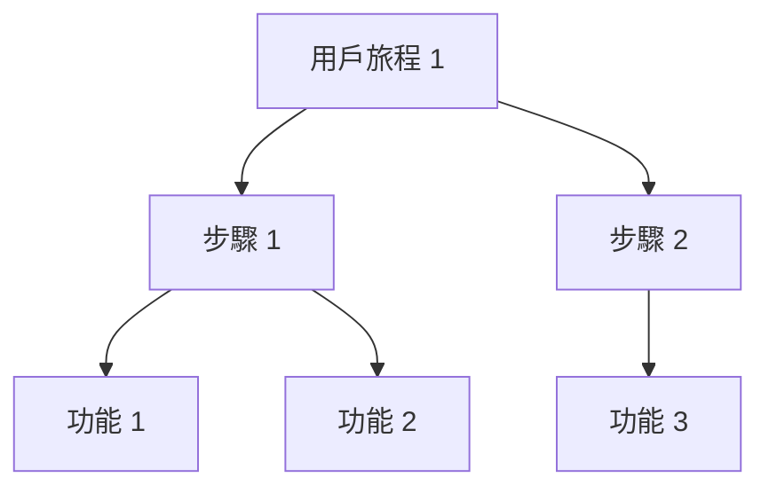

# [專案名稱] 需求規格書

## 文件資訊
| 項目 | 內容 |
|------|------|
| 文件狀態 | [草稿/審查中/已核准] |
| 版本 | [1.0.0] |
| 作者 | [作者名稱] |
| 審查者 | [審查者名稱] |
| 最後更新 | [YYYY-MM-DD] |

## 1. 執行摘要
[簡短描述專案的主要目標、價值主張和關鍵成功指標]

## 2. 專案概述

### 2.1 背景說明
- [市場需求/問題陳述]
- [現有解決方案的限制]
- [為什麼現在需要這個專案]

### 2.2 目標用戶
| 用戶類型 | 特徵描述 | 主要需求 | 使用場景 |
|----------|----------|----------|----------|
| [用戶 1] | [描述] | [需求] | [場景] |
| [用戶 2] | [描述] | [需求] | [場景] |

### 2.3 專案目標
1. **業務目標**
   - [可量化的業務指標]
   - [預期的市場影響]
   - [收入/成本目標]

2. **用戶目標**
   - [改善用戶體驗]
   - [解決用戶痛點]
   - [提供新價值]

3. **技術目標**
   - [性能指標]
   - [可擴展性要求]
   - [技術創新點]

## 3. 功能需求

### 3.1 核心功能
| 功能 ID | 功能名稱 | 優先級 | 描述 | 驗收標準 |
|---------|----------|--------|------|----------|
| F1 | [功能 1] | [高/中/低] | [描述] | [標準] |
| F2 | [功能 2] | [高/中/低] | [描述] | [標準] |

### 3.2 使用者故事地圖

### 3.3 功能優先級矩陣
| 功能 | 用戶價值 | 技術複雜度 | 業務價值 | 最終優先級 |
|------|----------|------------|----------|------------|
| [功能 1] | [高/中/低] | [高/中/低] | [高/中/低] | [P0/P1/P2] |
| [功能 2] | [高/中/低] | [高/中/低] | [高/中/低] | [P0/P1/P2] |

## 4. 非功能需求

### 4.1 性能需求
- **響應時間**
  - [頁面加載時間]
  - [API 響應時間]
  - [數據處理時間]

- **可擴展性**
  - [並發用戶數]
  - [數據存儲容量]
  - [處理能力]

- **可用性**
  - [系統運行時間]
  - [故障恢復時間]
  - [維護窗口]

### 4.2 安全需求
- **認證與授權**
  - [用戶認證方式]
  - [權限管理]
  - [訪問控制]

- **數據安全**
  - [加密要求]
  - [數據備份]
  - [隱私保護]

### 4.3 合規需求
- [法規要求]
- [行業標準]
- [公司政策]

## 5. 技術要求

### 5.1 系統架構
- **前端技術**
  - [框架選擇]
  - [UI 組件]
  - [開發標準]

- **後端技術**
  - [服務架構]
  - [數據庫選擇]
  - [API 設計]

- **基礎設施**
  - [部署環境]
  - [監控系統]
  - [運維工具]

### 5.2 整合需求
- **外部系統**
  - [系統名稱]
  - [整合方式]
  - [數據流向]

- **內部系統**
  - [系統名稱]
  - [依賴關係]
  - [接口要求]

## 6. 專案限制

### 6.1 技術限制
- [技術棧限制]
- [性能限制]
- [兼容性要求]

### 6.2 業務限制
- [預算限制]
- [時間限制]
- [資源限制]

### 6.3 法規限制
- [法律要求]
- [行業規範]
- [數據合規]

## 7. 驗收標準

### 7.1 功能驗收
| 功能 | 測試案例 | 通過標準 | 優先級 |
|------|----------|----------|--------|
| [功能 1] | [案例] | [標準] | [高/中/低] |
| [功能 2] | [案例] | [標準] | [高/中/低] |

### 7.2 性能驗收
| 指標 | 目標值 | 測試方法 | 驗收條件 |
|------|--------|----------|----------|
| [指標 1] | [目標] | [方法] | [條件] |
| [指標 2] | [目標] | [方法] | [條件] |

### 7.3 用戶驗收
- [用戶測試計劃]
- [滿意度指標]
- [反饋機制]

## 8. 風險評估

### 8.1 技術風險
| 風險描述 | 影響程度 | 發生概率 | 緩解策略 | 負責人 |
|----------|----------|----------|----------|--------|
| [風險 1] | [高/中/低] | [高/中/低] | [策略] | [負責人] |
| [風險 2] | [高/中/低] | [高/中/低] | [策略] | [負責人] |

### 8.2 業務風險
| 風險描述 | 影響程度 | 發生概率 | 緩解策略 | 負責人 |
|----------|----------|----------|----------|--------|
| [風險 1] | [高/中/低] | [高/中/低] | [策略] | [負責人] |
| [風險 2] | [高/中/低] | [高/中/低] | [策略] | [負責人] |

## 9. 時程規劃

### 9.1 里程碑
| 里程碑 | 預計完成時間 | 關鍵交付物 | 負責團隊 |
|--------|--------------|------------|----------|
| [里程碑 1] | [日期] | [交付物] | [團隊] |
| [里程碑 2] | [日期] | [交付物] | [團隊] |

### 9.2 發布計劃
| 版本 | 功能範圍 | 發布日期 | 相依關係 |
|------|----------|----------|----------|
| [1.0] | [功能列表] | [日期] | [相依項] |
| [1.1] | [功能列表] | [日期] | [相依項] |

## 10. 維護計劃

### 10.1 運維需求
- [監控要求]
- [備份策略]
- [故障處理]

### 10.2 更新維護
- [定期更新計劃]
- [版本控制策略]
- [向後兼容性]

### 10.3 技術支持
- [支持範圍]
- [響應時間]
- [升級服務]

## 附錄

### A. 術語表
| 術語 | 定義 | 備註 |
|------|------|------|
| [術語 1] | [定義] | [備註] |
| [術語 2] | [定義] | [備註] |

### B. 參考文檔
- [相關文檔 1]
- [相關文檔 2]
- [相關文檔 3]

### C. 變更記錄
| 版本 | 日期 | 變更者 | 變更描述 |
|------|------|--------|----------|
| [版本] | [日期] | [變更者] | [描述] | 